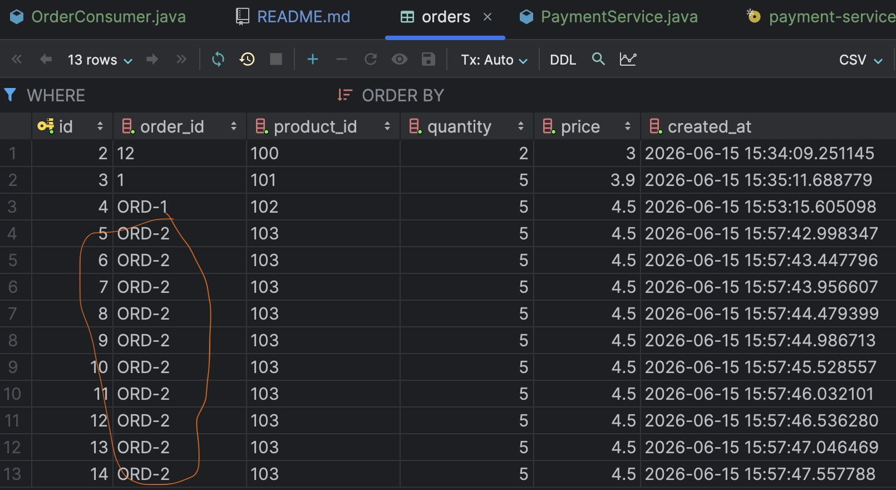
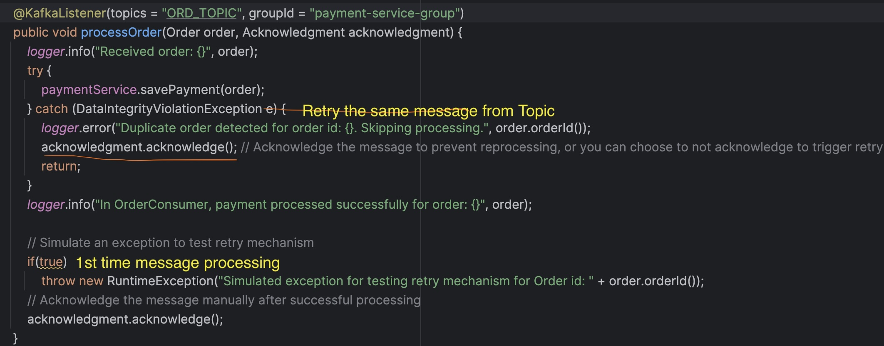
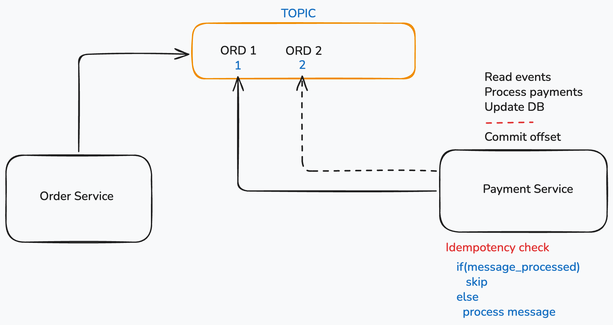

## Kafka Idempotency

### Overview
This project demonstrates a microservices-based architecture using **Spring Boot**, **Java 21**, and **Apache Kafka**. It focuses on implementing idempotency in Kafka-based messaging systems to ensure message processing reliability.

#### SDKMAN
Using .**_sdkmanrc_** file we can enable project specific java and maven versions

```
java=21.0.7-tem
maven=3.9.6
```

#### Maven Wrapper
Install maven wrapper to run maven commands on ease.

```
mvn wrapper:wrapper
./mvnw clean build
```

#### Swagger Link
* Producer: http://localhost:8081/swagger-ui/index.html


#### Retry Mechanism
Only if the message is acknowledged, OFFSET will be moved to the next message. If an exception occurs before acknowledgment, the message will be reprocessed, leading to potential duplicate entries in the database.

To simulate retry mechanism:
```
    @KafkaListener(topics = "ORD_TOPIC", groupId = "payment-service-group")
    public void processOrder(Order order, Acknowledgment acknowledgment) {
        logger.info("Received order: {}", order);
        try {
            paymentService.savePayment(order);
        } catch (Exception e) {
            logger.error("Error processing payment for order: {}. Error: {}", order, e.getMessage());
            acknowledgment.acknowledge(); // Acknowledge the message to prevent reprocessing, or you can choose to not acknowledge to trigger retry
            return;
        }
        logger.info("In OrderConsumer, payment processed successfully for order: {}", order);

        // Simulate an exception to test retry mechanism
        if(true)
            throw new RuntimeException("Simulated exception for testing retry mechanism for Order id: " + order.orderId());
        // Acknowledge the message manually after successful processing
        acknowledgment.acknowledge();
    }
```
Here, the order has been processed multiple times (10 times by default) and causing duplicate entries in the database. This is extremely dangerous if payment amount is involved.
Since the acknowledgment is done after the exception, the message will be reprocessed, leading to multiple entries for the same order in the database.



To avoid this, we can implement idempotency by checking if the order has already been processed before saving it to the database.

### Idempotency Implementation
There are 2 ways to implement idempotency in this project:

1) Check if the order already exists in the database before saving it. Fetch order based on the Order Id and if the order already exists, skip the save operation.
2) Implement Unique constraint on the Order Id column in the database. This way, if an attempt is made to save a duplicate order, it will throw an exception which can be caught and handled gracefully.

We implemented above **_DB unique constraint approach_** in this project using flyway schema. Below is the code snippet for the same:

```
**V2__add_constraint.sql**
>> alter table if exists orders add constraint unique_order_id unique (order_id);
```


* During the first attempt to process the order, it will be saved successfully. But there is another error in the code which is simulating an exception after saving the order, so the acknowledgment will not be sent and the message will be reprocessed. 
* During the second attempt, when it tries to save the same order again, it will violate the unique constraint on the order_id column and throw an exception. This way, we can ensure that even if there are retries due to exceptions, we won't end up with duplicate entries in the database.

In the first attempt the acknowledge was not provided to the kafka and hence the message was reprocessed multiple times, but due to the unique constraint on the order_id column, it prevented duplicate entries in the database and threw an exception instead. This is how we can implement idempotency in Kafka-based messaging systems to ensure data integrity and reliability.

